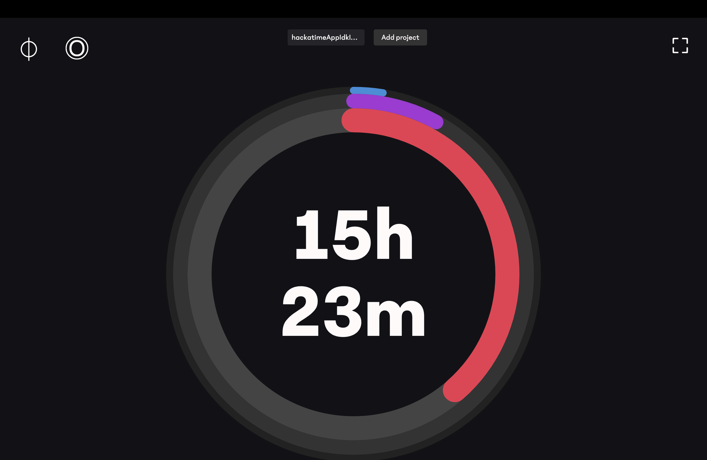

# Hackatime Displayer
---
> an app to put on your side computer or display while you're coding that shows your live hackatime hours!

it's an electron app (ew i know, whatever), gives you some freedom to customize how it looks
you do have to give it your hackatime api key though, but only for the first time!

## Installation
just ... download and run the file attached in the releases section on the github

if it takes a while to launch the first time, don't worry, just be patient... it will launch, just check your DMs or something in the meantime...

If it shows "Hackatime Displayer Not Opened", go into System Settings > Security and click Open

---

here's a screenshot :D

made with much insanity by astra